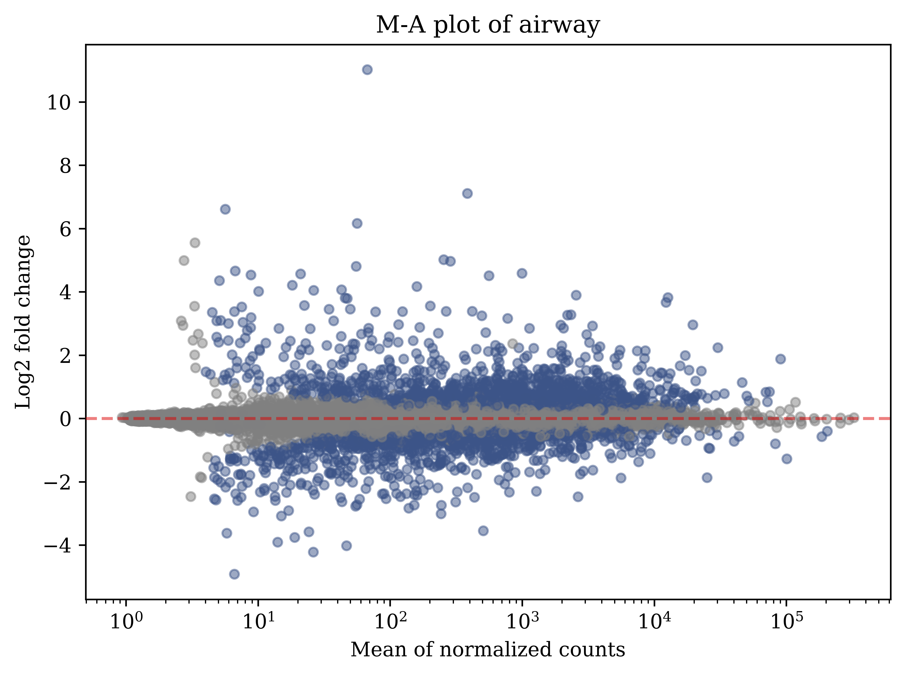
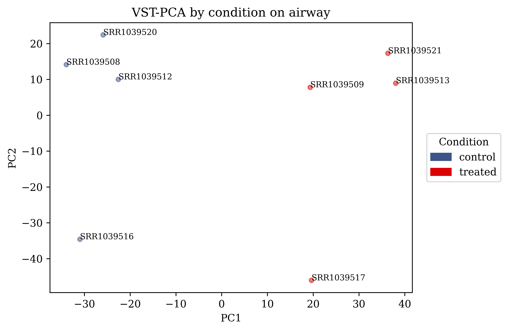
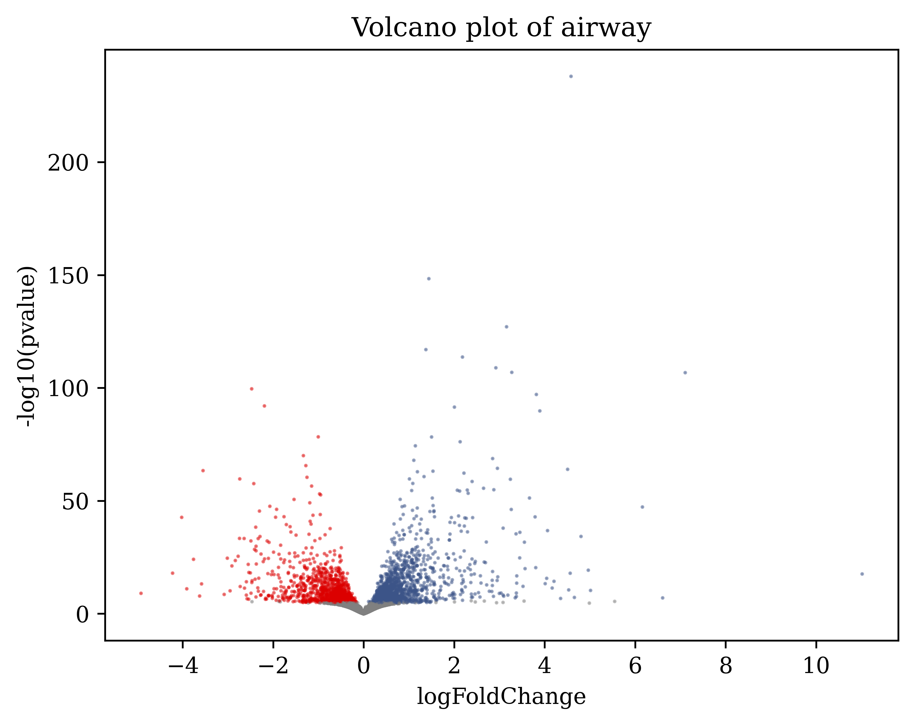
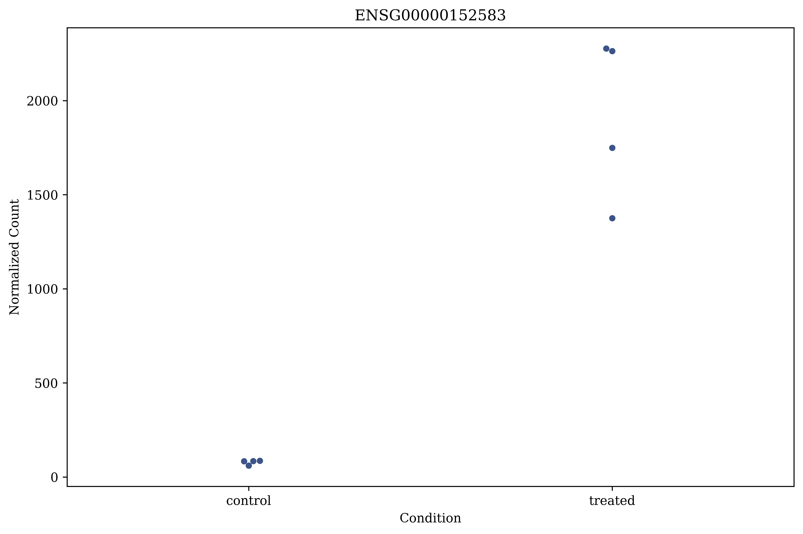
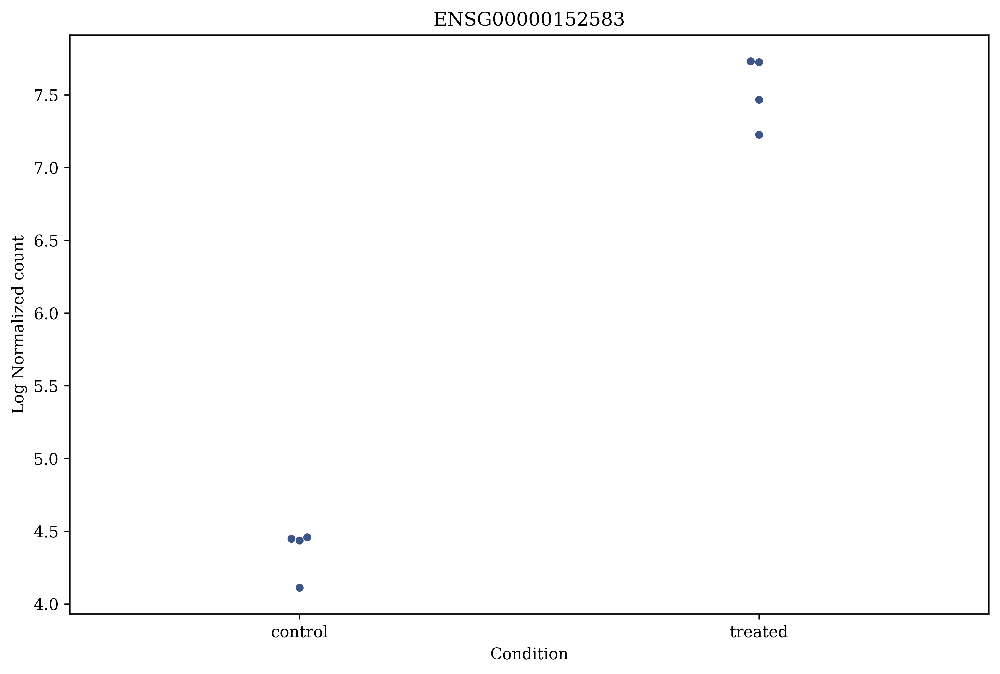
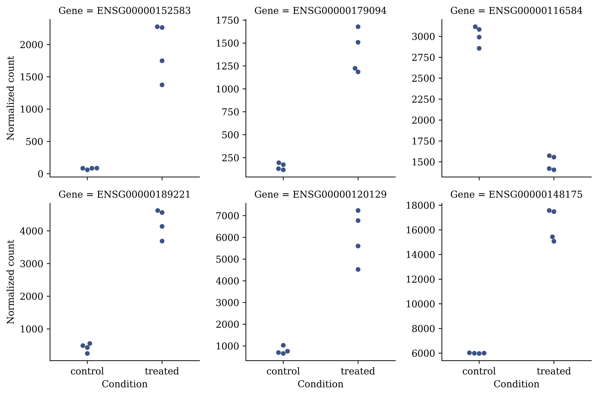
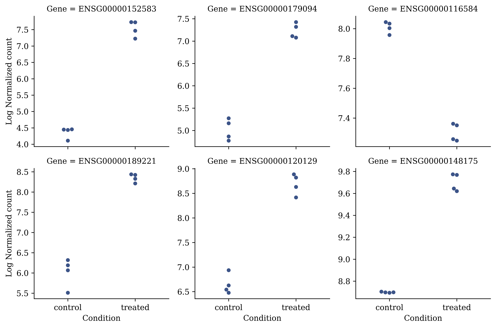

# Pydeseq2 wrapper

A simple wrapper script for the pydeseq2 program. Extends pydeseq2 functionality with new plotting functions.


Reference
-  Muzellec B, Teleńczuk M, Cabeli V, Andreux M. PyDESeq2: a python package for bulk RNA-seq differential expression analysis. Bioinformatics. 2023;39(9):btad547. doi:10.1093/bioinformatics/btad547
- https://pydeseq2.readthedocs.io/en/stable/


# Presequisities
### OS

- Unix-based systems (Tested on Ubuntu 24.04)

### Programs
- Pydeseq2 (0.5.3)
    - `pip install pydeseq2` Refer to the official documenation for pydeseq2 for more
- Pandas (2.3.3)
    - `pip install pandas`
- Numpy (1.26.4)
    - `pip install numpy`
- matplotlib (3.10.1)
    - `pip install matplotlib`
- seaborn (0.13.2)
    - `pip install seaborn`
### Dataset (optional)

- Airway dataset (Himes et al., 2014)
    - The repo will use the airway dataset as an example. Retrieved from https://bioconnector.github.io/workshops/data.html
    - The raw data is to be placed under `./data/`

# Installation
1. Clone this repo 
2. Place your scripts in this repo

# Usage
This wrapper script extends the functionality of the Pydeseq2 objects by unifying the `DeseqDataSet` and `DeseqStats` objects under a single `rna_dataset` object. 


Basic reproducible pipeline

0. Import package
    ```python
    from utils import rna_analysis as analysis
    ```

1. Initalize the `rna_dataset` object by calling the raw data

    ```python
    airway_set = analysis.rna_dataset("./data/airway_rawcounts.csv", #raw counts
                                    "./data/airway_metadata.csv", #metadata
                                    ("control, treated"), #types of condition
                                    'dex' #column header for the condition column,
                                    name = "airway", #name of the dataset, used in downstream plots (optional)
                                    )
    ```
    :warning: The `fix_raw` flag can be turned on in case your raw counts needs to transposed. In the airway dataset, this needs to be done     (Default = True)

    :warning: Turn on the `filter_counts` flag to filter raw counts less than the designated threshold set by the `filter_threshold` flag. (Default = 10)

2. Initalize the pydeseq2 analysis pipline
    ```python
    airway_set.initalize()
    ```
    This function sets up the inference objects, loads the design groups and intialize the deseqdataset object. Set the number of cpus using the `ncpu` flag.

3. Run inference
    ```python
    airway_set.run_inference()
    ```
    This function runs the deseq2 anaylsis and generates the resulting summary()

    The `set_norm` flag saves the normalized counts as a `self._norm_count()` object. (Defaults = True) In case you wish not to run this, turn the flag to False

4. Variance stablizing transformation (VST)

    ```python
    airway_set.vst()
    ```
    Runs VST on the resulting dataframe. Turn on the `return_data` flag to return the dataframe for other custom functions.


5. Shrink Log Fold Changes

    ```python
    airway_set.shrinklfc()
    ```

    For downstream plotting, you may wish to shrink the log fold change using the `shrinklfc()` function. Turn on the `return_data` flag to return the dataframe for other custom functions.

    :warning: By default, the `self.dds.obsm["design_matrix"].columns[1]` will be used for the coefficient for lfc. In case you are not sure. Call the `check_shrink_lfc()` function if you are not sure.

    :warning: The original lfc_shrink function will override the results from `self.ds.results_df`.


The script also improves the plotting function for M-A plots by addition of new colour plaettes. Three new plotting functions `plot_PCA`, `plot_volcano` and `plot_gene_compare` are also introduced for volcano plot and gene comparison plots respectively.

### MA plot
The `plot_MA()` function is largely the same as the original implementation of accepts `rna_dataset` objects as input. You can additionally edit the colour of significant genes using the `colour` flag.

```python
analysis.plot_MA(airway_set, save_path = "./plots/airway_MA_plot.png", s = 20)
```

if you have set a name for your dataset, this will appear in the plot


### PCA plot
The `plot_PCA()` integrates VST counts into a PCA plot. 

:warning: only run this after running the `vst()` function. Otherwise errors will be thrown for accessing a non-existent object.

```python
analysis.plot_PCA(airway_set,   
                    save_path='./plots/airway_PCA.png', 
                    s = 20)
```


_The plot can be a bit wonky if you add text annotation_ 

### Volcano plot
The `plot_volcano` provides a function for plotting a volcano plot based on the analysed `rna_dataset` object.

```python
analysis.plot_volcano(airway_set,
                        save_path = './plots/airway_volcano.png')
```


:warning: it's generally recommended to use this volcano plot as a starting point, add additional keyword arguments for better control of the plot.

### Gene comparison
The `plot_gene_compare` function allows for beeswarm plots of genes of interest to be plotted based on the different groupings of your dataset.

Let's use a single gene as an example

:warning: make sure the gene parsed is appears in your raw counts. This requires exact matches (both for single and multi gene comparisons).

```python
analysis.plot_gene_compare(airway_set, 
                            gene = "ENSG00000152583",
                            save_path = './plots/airway_compare_single_f.png',
                            log_transform = False)  
```
By default log transformation of the y-axis is disabled. Turn this on through the `log_transform` flag.



with `log_transform` as `True`


The `gene` flag also accepts genes in a `list` as well

```python
genelist = ["ENSG00000152583", "ENSG00000179094", "ENSG00000116584", "ENSG00000189221", "ENSG00000120129", "ENSG00000148175"]

analysis.plot_gene_compare(airway_set, 
                            gene = genelist,
                            save_path = './plots/airway_compare_mult_f.pngg',
                            log_transform = False)  
```



Note the different y axis ranges.

The same log transformation can be done for multi-gene visulizations

```python
analysis.plot_gene_compare(airway_set, 
                            gene = genelist,
                            save_path = './plots/airway_compare_mult_t.pngg',
                            log_transform = True)  
```


:warning: :warning: **Do not use these results with other univariate tests (e.g. T-tests). The statistical tests of your dataset has already been done using Wald Test on the entire dataset. Any significance found here would be superfluous, even misleading.